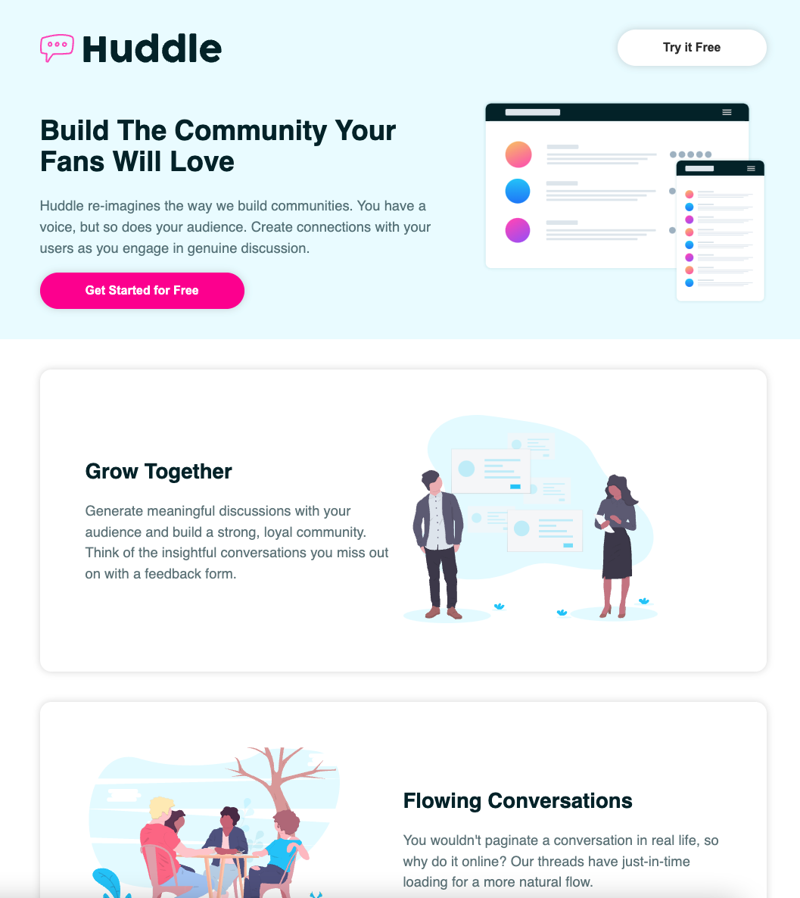

Practice styling in React with styled components

# Method:

- Use a style component for each React component
- Utility components (flex, container) that are used in multiple components
- Work with global theme, passed in with props

# Main takeaways:
- Allows to style element dynamically (using props from React)
- Reusable 
- Responsive (media queries)
- Works using template literals and regular CSS syntax, flexbox etc. 

# Packages used:
- styled-components
- react-icons 

# Screenshots:

